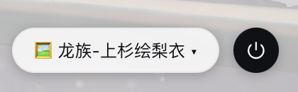
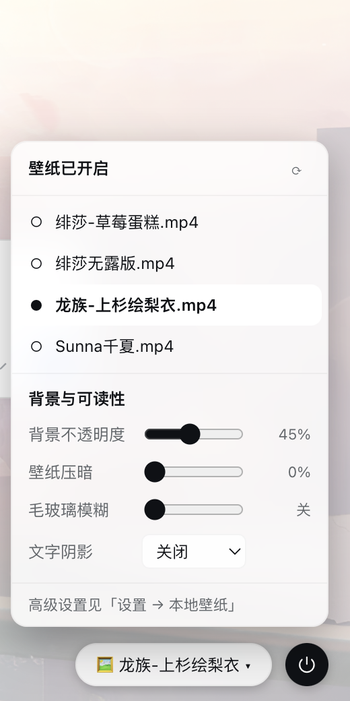

# DSH 本地壁纸（dsh-wallpaper-local）

不依赖 Wallpaper Engine 的 DSH 背景主题插件：直接用**本地图片 / 视频**（或随插件分发的内置 SVG 渐变）做应用背景。**手动选择壁纸**（选择会保存），右下角有**壁纸控制胶囊**，点击展开小面板即可切换壁纸 / 关闭背景，轻便不占地。图片交叉淡化，视频作为底层循环播放，支持压暗、毛玻璃、面板透明度、文字阴影，设置页一键配置并持久化。

> 📦 本目录即完整可安装插件包，`dsh plugin add` 直接安装。

**右下角壁纸控制区（胶囊 + 一键电源开关）**



**点击胶囊展开面板（切换壁纸 / 刷新 / 可读性调节）**



## 特性

- **无需 Wallpaper Engine**：不读 Steam 库，只用普通文件，公司电脑可直接用。
- **图片 + 视频都支持**：图片 png / jpg / webp / gif / bmp / avif / svg；视频 mp4 / webm / mov / m4v / ogv。
- **手动选择壁纸**：设置页「选择壁纸」列表点选即切换，选择持久化，刷新 / 重启后保持。
- **壁纸控制胶囊**：右下角悬浮小胶囊显示当前壁纸名，点击展开小面板——顶部开关一键关闭/开启背景，下方壁纸列表点选即切换（选择持久化）。
- **无自动轮换**：壁纸不会自动切换，避免打扰，想换自己换。
- **平滑动效**：图片交叉淡化；视频带 Range 支持（可正常 seek）。
- **内置壁纸集**：4 张 SVG 渐变（晨光 / 海洋 / 暮色 / 林间），未配置文件夹或无效时自动使用。
- **可读性**：背景不透明度（侧边栏与对话区统一）、壁纸压暗、毛玻璃模糊（0–24px）、文字阴影（三档）。
- **统一半透明**：侧边栏与对话区共用同一背景不透明度，壁纸透出且两侧视觉一致；开启全屏后侧边栏完全透明、壁纸完整透出。
- **视频声音**：静音开关 + 音量调节（浏览器通常拦截带声自动播放，建议保持静音）。
- **持久化**：配置存 `$DSH_HOME/wallpaper-local.json`，重启保留。

## 快速开始

```bash
# 1. 安装（GitHub / 本地路径均可）
dsh plugin --profile web add github:qwe907098478/dsh-wallpaper-local # GitHub
dsh plugin --profile web add /path/to/dsh-wallpaper-local           # 本机本地路径

# 2. 重启 dsh web 生效
dsh web
```

重启后：

- 默认立即使用内置壁纸集；到 **设置 → 本地壁纸** 输入图片 / 视频文件夹路径（或「浏览…」）并「应用」。
- 在 **设置 → 本地壁纸 → 选择壁纸** 点「设为背景」切换壁纸（选择自动保存）。
- 右下角浮动按钮一键关闭 / 开启壁纸。

卸载：

```bash
dsh plugin --profile web remove dsh-wallpaper-local
```

## 目录结构

```
.
├── package.json          # dsh.bundle.patch + dsh.client 声明
├── cordis.patch.yml      # 插件行 { id: wallpaper-local, ... }
├── lib/index.js          # Host 半区：路由（扫描/媒体字节含 Range/内置壁纸/配置）
├── lib/client.js         # 浏览器半区：背景引擎（图片+视频）+ 快捷开关 + 设置页
└── README.md
```

## 配置参考

设置页修改自动写回 `$DSH_HOME/wallpaper-local.json`。默认值：

| 项 | 默认 | 说明 |
|---|---|---|
| 文件夹 | 空 | 留空 = 内置壁纸集 |
| 当前壁纸 | 空 | 手动选择的壁纸文件名，刷新保持 |
| 过渡时长 | 1.2 秒 | 切换壁纸时的交叉淡化 |
| 全屏显示 | 关 | 开 = 侧边栏完全透明、壁纸完整透出；关 = 两侧统一半透明背景 |
| 面板透明度 | 80% | 卡片 / 浮层 |
| 背景不透明度 | 55% | 侧边栏与对话区统一的半透明深浅（越低壁纸越透出） |
| 壁纸压暗 | 30% | 随壁纸层内嵌 |
| 毛玻璃模糊 | 10px | 0 = 关闭 |
| 文字阴影 | 轻微 | 关 / 轻微 / 明显 |
| 视频静音 | 开 | 关掉后按音量播放 |
| 音量 | 30% | 0–100% |

## 常见问题

**重启后设置里没有「本地壁纸」？**
确认 `dsh plugin add` 后 `profiles/web/package.json` 的 `dsh.profile.bundles` 包含 `dsh-wallpaper-local`；重启的是 `dsh web` 进程本身。

**boot 页报 "Failed to load plugins"？**
通常为 client bundle 语法错误——`node --check lib/client.js` 校验，并检查浏览器控制台具体报错。

**视频不自动播放？**
浏览器 autoplay 策略要求静音才能自动播放；保持「静音播放」开关打开即可。带声音的视频需要用户先在页面上点过一次。

**怎么切到另一张壁纸？**
打开 **设置 → 本地壁纸 → 选择壁纸**，点击目标壁纸的「设为背景」即可，选择会保存。

## 校验

```bash
node --check lib/index.js
node --check lib/client.js
```

## License

MIT
